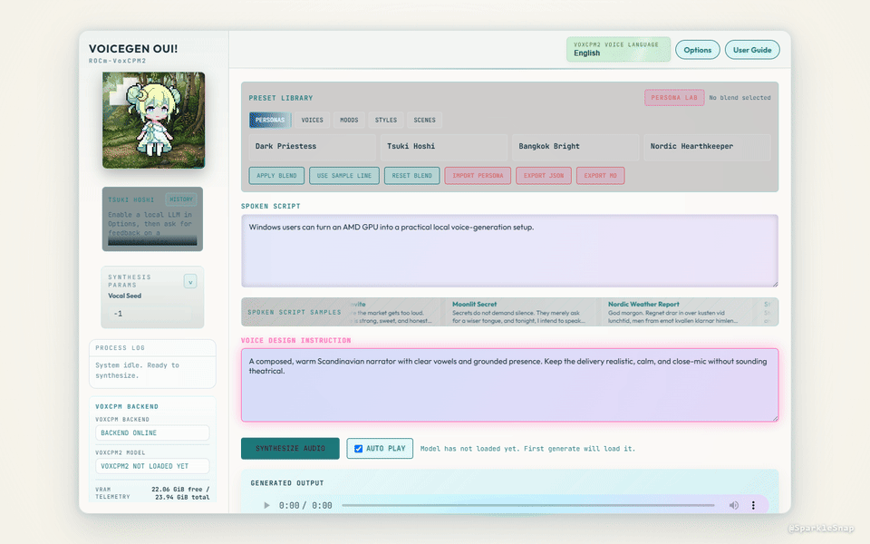

# VoiceGen Oui! (ROCm-VoxCPM2)

**ROCm-powered VoxCPM2 voice generation for Windows users who want to use their AMD GPU instead of falling back to CPU.**



## Listen

**Official SparkleSnap / Tsuki Hoshi high-quality sample**

<video controls preload="metadata" src="https://raw.githubusercontent.com/cesarborgenkrans-gif/VoiceGen-Oui-ROCm-VoxCPM2/main/docs/assets/sparklesnap-tsuki-hoshi-high-quality.mp4">
  <a href="https://raw.githubusercontent.com/cesarborgenkrans-gif/VoiceGen-Oui-ROCm-VoxCPM2/main/docs/assets/sparklesnap-tsuki-hoshi-high-quality.mp4">Play the high-quality sample</a>
</video>

**VoiceGen Oui! reference voice sample 02**

<video controls preload="metadata" src="https://raw.githubusercontent.com/cesarborgenkrans-gif/VoiceGen-Oui-ROCm-VoxCPM2/main/docs/assets/voicegen-oui-reference-sample-02.mp4">
  <a href="https://raw.githubusercontent.com/cesarborgenkrans-gif/VoiceGen-Oui-ROCm-VoxCPM2/main/docs/assets/voicegen-oui-reference-sample-02.mp4">Play reference voice sample 02</a>
</video>

**VoiceGen Oui! reference voice sample 03**

<video controls preload="metadata" src="https://raw.githubusercontent.com/cesarborgenkrans-gif/VoiceGen-Oui-ROCm-VoxCPM2/main/docs/assets/voicegen-oui-reference-sample-03.mp4">
  <a href="https://raw.githubusercontent.com/cesarborgenkrans-gif/VoiceGen-Oui-ROCm-VoxCPM2/main/docs/assets/voicegen-oui-reference-sample-03.mp4">Play reference voice sample 03</a>
</video>

**VoiceGen Oui! reference voice sample 04**

<video controls preload="metadata" src="https://raw.githubusercontent.com/cesarborgenkrans-gif/VoiceGen-Oui-ROCm-VoxCPM2/main/docs/assets/voicegen-oui-reference-sample-04.mp4">
  <a href="https://raw.githubusercontent.com/cesarborgenkrans-gif/VoiceGen-Oui-ROCm-VoxCPM2/main/docs/assets/voicegen-oui-reference-sample-04.mp4">Play reference voice sample 04</a>
</video>

VoiceGen Oui! is the practical ROCm layer around VoxCPM2: a local GUI and Windows-to-WSL bridge for AMD GPU users. It makes the ROCm path approachable on Windows, where the usable route is WSL2 rather than the direct Linux setup many AMD users already have.

**Reference hardware:** AMD Radeon RX 7900 XTX / `gfx1100`

**Quality / speed setting:** `8` timesteps is the project setting for the fastest generation that still meets VoiceGen Oui!'s target quality. Recorded RX 7900 XTX reference sessions have reached **8.24-10.03 it/s** with this setting.

For the official SparkleSnap high-quality voice reference using the Tsuki Hoshi persona, see [docs/QUALITY_PRESETS.md](docs/QUALITY_PRESETS.md).

Built by **Cesar Borgenkrans** / [SparkleSnap](https://sparklesnap.dev/). The four samples above are intentional public demo media; ordinary generated audio remains local and gitignored.

## What It Unlocks

This is not the upstream VoxCPM2 model or training project. It is the utility layer that makes the ROCm path practical on Windows: write a voice design, generate locally, compare results, and help improve AMD GPU compatibility for the next person.

## Model Files

Get the upstream VoxCPM2 model directly from [OpenBMB on Hugging Face](https://huggingface.co/openbmb/VoxCPM2) and place it in `%LOCALAPPDATA%\VoiceGenOui\models\VoxCPM2`, or run the included downloader:

```powershell
.\download_voxcpm_models.ps1
```

The script downloads the same upstream model into that folder with native Windows PowerShell and `curl.exe`; it does not need WSL or ROCm. Need the Windows + WSL2 + ROCm environment first? Follow the [ROCm WSL setup guide](docs/ROCM_WSL_SETUP.md).

## Run

From the repository root in Windows PowerShell:

```powershell
.\start_voicegen_oui_voxcpm_wsl_rocm7.ps1
```

The launcher waits for VoiceGen Oui! to become healthy, then opens the app in your default browser. Use `-NoBrowser` when you only want to start the backend. The launcher window stays open when it stops or encounters an error; use `-NoPause` only for scripted launches.

To stop the hidden backend later, run:

```powershell
.\stop_voicegen_oui.ps1
```

This stops only the VoiceGen server started for this checkout. The browser tab can remain open; it will simply stop responding until you launch VoiceGen again.

To open your local outputs, user personas, logs, and optional user-managed models, double-click `open_voicegen_oui_data_folder.cmd` in the repository root. Custom personas are stored under `%LOCALAPPDATA%\VoiceGenOui\user-personas`.

## Try It, Test It, Improve It

If you use Windows with an AMD GPU and want to help make VoxCPM2 more usable through ROCm and WSL2, this repo is for you.

- Test your AMD card and share what happened.
- Send launcher, setup, or documentation fixes.
- Report successful runs, partial runs, and useful failures.

The most useful contribution is a hardware test report with your GPU, ROCm version, PyTorch ROCm result, VoxCPM2 result, and observed speed. Start with [CONTRIBUTING.md](CONTRIBUTING.md) or [open a hardware report](https://github.com/cesarborgenkrans-gif/VoiceGen-Oui-ROCm-VoxCPM2/issues/new?template=hardware-test.yml).

## Local-Only Files

The repository contains source code, docs, lightweight placeholders, and the curated README demo media above. Runtime outputs, custom personas, logs, and optional user-managed models live in `%LOCALAPPDATA%\VoiceGenOui`; model weights, Python environments, and `.env` files are not committed. See [.gitignore](.gitignore) and [the path guide](docs/dev_paths.md) for the exact rules.

## License And Notices

The utility code and documentation are [Apache-2.0](LICENSE). Mascots, logos, SparkleSnap marks, screenshots, and README/demo media are separate reserved assets under [docs/ASSET_LICENSE.md](docs/ASSET_LICENSE.md).

Third-party models, libraries, and assets keep their own licenses; see [docs/THIRD_PARTY_NOTICES.md](docs/THIRD_PARTY_NOTICES.md) and [NOTICE](NOTICE). VoiceGen Oui! is independent and is not affiliated with, sponsored by, or endorsed by AMD or OpenBMB. AMD ROCm and related marks are trademarks of Advanced Micro Devices, Inc.

## Cite VoxCPM

VoiceGen Oui! is a utility layer around the upstream VoxCPM work. If it helps your research or project, please cite the VoxCPM2 technical report and the original VoxCPM paper as requested by [OpenBMB](https://github.com/OpenBMB/VoxCPM):

```bibtex
@article{zhou2026voxcpm2,
  title   = {VoxCPM2 Technical Report},
  author  = {Zhou, Yixuan  and Zeng, Guoyang and Liu, Xin and Li, Xiang and Yu, Renjie and Gui, Jiancheng and Wu, Jiaheng and Wang, Ziyang and Shen, Xudong and Ye, Runchuan  and Zhang, Zhisheng and Zhou, Jiuyang and Bai, Bingsong and Sun, Weiyue and Deng, Mengyuan and Shi, Qundong and Wu, Zhiyong and Liu, Zhiyuan},
  journal = {arXiv preprint arXiv:2606.06928},
  year    = {2026},
}

@article{zhou2025voxcpm,
  title = {Voxcpm: Tokenizer-free TTS for context-aware speech generation and true-to-life voice cloning},
  author = {Zhou, Yixuan and Zeng, Guoyang and Liu, Xin and Li, Xiang and Yu, Renjie and Wang, Ziyang and Ye, Runchuan and Sun, Weiyue and Gui, Jiancheng and Li, Kehan and Wu, Zhiyong and Liu, Zhiyuan},
  journal = {arXiv preprint arXiv:2509.24650},
  year = {2025}
}
```

Enjoy and have fun,
SparkleSnap
