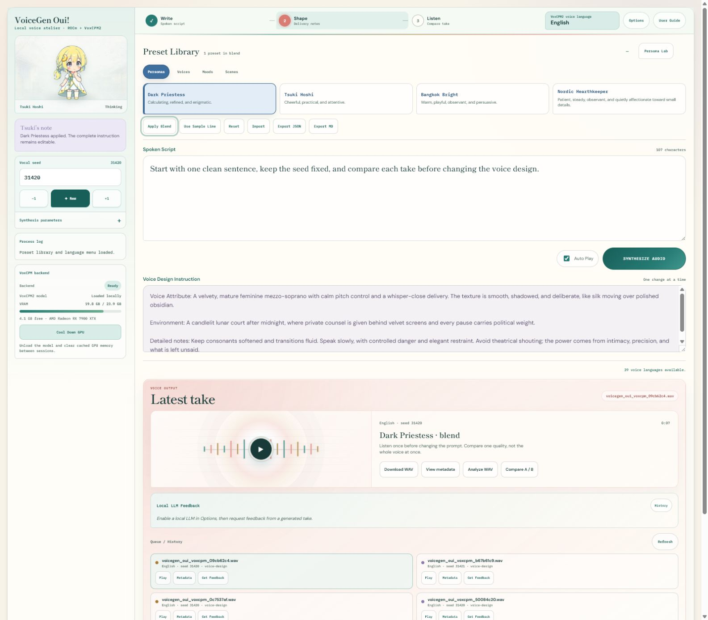
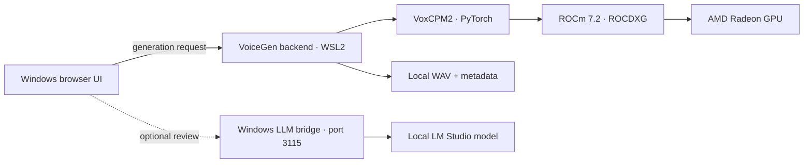
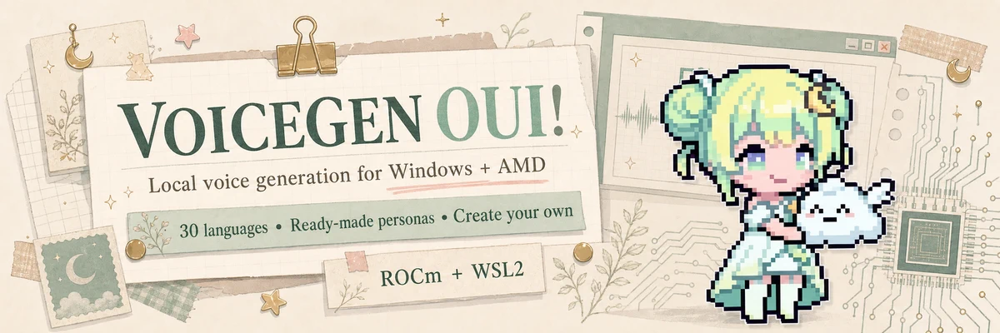

# VoiceGen Oui! (ROCm-VoxCPM2)

**ROCm-powered VoxCPM2 voice generation for Windows users who want to use their AMD GPU instead of falling back to CPU.**

**It supports 39 voice-generation languages!**



## AMD Radeon + ROCm Architecture

VoiceGen Oui! turns written scripts and natural-language voice direction into local audio through VoxCPM2. It gives Windows creators a complete visual workflow for designing voices, combining Persona and delivery layers, comparing seeded takes, inspecting WAV metadata, and requesting script-aware feedback from an optional local LLM.



| AMD implementation evidence | Current reference |
| --- | --- |
| GPU | AMD Radeon RX 7900 XTX (`gfx1100`) |
| Runtime path | Windows 11 → WSL2 Ubuntu 22.04 → ROCm 7.2 / ROCDXG → PyTorch ROCm |
| Reference quality setting | 8 inference timesteps |
| Observed reference speed | 8.24–10.03 iterations/second |
| Voice-language menu | 39 VoxCPM2 generation languages and dialects |
| Privacy | Models, prompts, WAV files, metadata, personas, and optional LLM feedback stay local |

VoiceGen Oui! provides a complete AMD-native product path rather than a model demo alone: approachable installation, reproducible local generation, a polished creator interface, seed-controlled comparison, voice-design presets, consent-gated cloning tools, WAV inspection, and visible GPU telemetry.

## Listen

| Persona preset | Download MP4 samples |
| --- | --- |
| Tsuki Hoshi | [Sample 1](https://github.com/cesarborgenkrans-gif/VoiceGen-Oui-ROCm-VoxCPM2/raw/refs/heads/main/docs/assets/sparklesnap-tsuki-hoshi-high-quality.mp4) · [Sample 2](https://github.com/cesarborgenkrans-gif/VoiceGen-Oui-ROCm-VoxCPM2/raw/refs/heads/main/docs/assets/voicegen-oui-reference-sample-02.mp4) · [Sample 3](https://github.com/cesarborgenkrans-gif/VoiceGen-Oui-ROCm-VoxCPM2/raw/refs/heads/main/docs/assets/voicegen-oui-reference-sample-03.mp4) |
| Dark Priestess | [Sample 1](https://github.com/cesarborgenkrans-gif/VoiceGen-Oui-ROCm-VoxCPM2/raw/refs/heads/main/docs/assets/voicegen-oui-dark-priestess-reference-sample-01.mp4) · [Sample 2](https://github.com/cesarborgenkrans-gif/VoiceGen-Oui-ROCm-VoxCPM2/raw/refs/heads/main/docs/assets/voicegen-oui-dark-priestess-reference-sample-02.mp4) · [Sample 3](https://github.com/cesarborgenkrans-gif/VoiceGen-Oui-ROCm-VoxCPM2/raw/refs/heads/main/docs/assets/voicegen-oui-dark-priestess-reference-sample-03.mp4) |
| Default (Jpn) | [Sample 1](https://github.com/cesarborgenkrans-gif/VoiceGen-Oui-ROCm-VoxCPM2/raw/refs/heads/main/docs/assets/voicegen-oui-default-japanese-sample-01.mp4) · [Sample 2](https://github.com/cesarborgenkrans-gif/VoiceGen-Oui-ROCm-VoxCPM2/raw/refs/heads/main/docs/assets/voicegen-oui-default-japanese-sample-02.mp4) |
| Dark Priestess (Jpn) | [Sample 1](https://github.com/cesarborgenkrans-gif/VoiceGen-Oui-ROCm-VoxCPM2/raw/refs/heads/main/docs/assets/voicegen-oui-dark-priestess-japanese-sample-01.mp4) · [Sample 2](https://github.com/cesarborgenkrans-gif/VoiceGen-Oui-ROCm-VoxCPM2/raw/refs/heads/main/docs/assets/voicegen-oui-dark-priestess-japanese-sample-02.mp4) |

VoiceGen Oui! is the practical ROCm layer around VoxCPM2: a friendly local GUI and Windows-to-WSL2 bridge that helps AMD GPU users start generating voices locally instead of falling back to CPU.

**Reference hardware:** AMD Radeon RX 7900 XTX / `gfx1100`

**Quality / speed setting:** `8` timesteps is the project setting for the fastest generation that still meets VoiceGen Oui!'s target quality. Recorded RX 7900 XTX reference sessions have reached **8.24-10.03 it/s** with this setting.

Built by **Cesar Borgenkrans** / [SparkleSnap](https://sparklesnap.dev/). The samples are intentional public demo media; your generated audio remains local and saved to `C:\Users\*username*\AppData\Local\VoiceGenOui`.

## What It Unlocks



Give your AMD GPU a welcoming local voice studio. Pick a ready-made persona, create your own in Persona Lab, switch between 39 languages and dialects, compare takes, and keep every generation on your machine. VoiceGen Oui! wraps the Windows-to-WSL2 ROCm path in a creative GUI that makes advanced voice generation feel easy to approach.

## Setup

Quick access to the setup guide, here [ROCM_WSL_SETUP.md](docs/ROCM_WSL_SETUP.md) 🌟

Download or clone VoiceGen Oui! right away. The repository stays lightweight because models and generated audio live in your local user-data folder.

The one-time Windows foundation is short:

- An AMD driver that supports ROCm on WSL.
- WSL2 with Ubuntu 22.04.
- ROCm 7.2 with ROCDXG.
- Python 3 with virtual-environment support inside WSL.

Once those prerequisites are in place, open the cloned repository inside WSL, activate your Python virtual environment, and let `requirements.txt` install the Python side:

```bash
pip install -r requirements.txt
```

That installs the pinned PyTorch ROCm packages, VoxCPM, and the other Python dependencies used by VoiceGen Oui!. Then download the model files below and use the launcher.

New to WSL2 or ROCm? The setup guide walks through the one-time setup with validation checks. For installation troubleshooting, use [CONTRIBUTING.md](CONTRIBUTING.md) to report where the setup stopped, share logs, or contribute a setup fix for the next Windows AMD user.

## Model Files

Get the upstream VoxCPM2 model directly from [OpenBMB on Hugging Face](https://huggingface.co/openbmb/VoxCPM2) and place it in `%LOCALAPPDATA%\VoiceGenOui\models\VoxCPM2`, or run the included downloader:

```powershell
.\download_voxcpm_models.ps1
```

The script downloads the upstream model files into that folder with native Windows PowerShell and `curl.exe`. It keeps the large model outside the repository and ready for the launcher to find.

## Run

From the repository root in Windows PowerShell:

```powershell
.\start_voicegen_oui_voxcpm_wsl_rocm7.ps1
```

The launcher waits for VoiceGen Oui! to become healthy, then opens the app in your default browser. Use `-NoBrowser` when you only want to start the backend. The launcher window stays open when it stops or encounters an error; use `-NoPause` only for scripted launches.

To stop the hidden backend later, run:

```powershell
.\stop_voicegen_oui.ps1
```

This stops only the VoiceGen server started for this checkout. The browser tab can remain open; it will simply stop responding until you launch VoiceGen again. Or use the Cool Down GPU button inside of the user interface for when you go AFK.

To open your local outputs, user personas, logs, and optional user-managed models, double-click `open_voicegen_oui_data_folder.cmd` in the repository root. Custom personas are stored under `%LOCALAPPDATA%\VoiceGenOui\user-personas`.

## Try It, Test It, Improve It

If you use Windows with an AMD GPU and want to help make VoxCPM2 more usable through ROCm and WSL2, this repo is for you.

- Test your AMD card and share what happened.
- Send launcher, setup, or documentation fixes.
- Report successful runs, partial runs, and useful failures.

The most useful contribution is a hardware test report with your GPU, ROCm version, PyTorch ROCm result, VoxCPM2 result, and observed speed. Start with [CONTRIBUTING.md](CONTRIBUTING.md) or [open a hardware report](https://github.com/cesarborgenkrans-gif/VoiceGen-Oui-ROCm-VoxCPM2/issues/new?template=hardware-test.yml).

VoiceGen Oui! will keep evolving, so please check back for new releases, GUI updates, more features, and fixes shaped by user feedback.

## Local-Only Files

The repository contains source code, docs, lightweight placeholders, and the curated README demo media above. Runtime outputs, custom personas, logs, and optional user-managed models live in `%LOCALAPPDATA%\VoiceGenOui`; model weights, Python environments, and `.env` files are not committed. See [.gitignore](.gitignore) and [the path guide](docs/dev_paths.md) for the exact rules.

## License And Notices

The utility code and documentation are [Apache-2.0](LICENSE). Mascots, logos, SparkleSnap marks, screenshots, and README/demo media are separate reserved assets under [docs/ASSET_LICENSE.md](docs/ASSET_LICENSE.md).

Third-party models, libraries, and assets keep their own licenses; see [docs/THIRD_PARTY_NOTICES.md](docs/THIRD_PARTY_NOTICES.md) and [NOTICE](NOTICE). VoiceGen Oui! is independent and is not affiliated with, sponsored by, or endorsed by AMD or OpenBMB. AMD ROCm and related marks are trademarks of Advanced Micro Devices, Inc.

## Citations

VoiceGen Oui! is a utility layer around the upstream VoxCPM work. The resource which makes this project possible is the actual VoxCPM2 project, and I really appreciate their work. Here's a citation as requested by [OpenBMB](https://github.com/OpenBMB/VoxCPM):

```bibtex
@article{voxcpm2_2026,
  title   = {VoxCPM2: Tokenizer-Free TTS for Multilingual Speech Generation, Creative Voice Design, and True-to-Life Cloning},
  author  = {VoxCPM Team},
  journal = {GitHub},
  year    = {2026},
}

@article{zhou2025voxcpm,
  title = {Voxcpm: Tokenizer-free TTS for context-aware speech generation and true-to-life voice cloning},
  author = {Zhou, Yixuan and Zeng, Guoyang and Liu, Xin and Li, Xiang and Yu, Renjie and Wang, Ziyang and Ye, Runchuan and Sun, Weiyue and Gui, Jiancheng and Li, Kehan and Wu, Zhiyong and Liu, Zhiyuan},
  journal = {arXiv preprint arXiv:2509.24650},
  year = {2025}
}
```

If my work with VoiceGen Oui! made this technology easier to approach and use, then please cite me:

```bibtex
@software{borgenkrans2026voicegenoui,
  author = {Borgenkrans, Cesar},
  title  = {VoiceGen Oui!: A Windows and WSL2 ROCm Utility for VoxCPM2 on AMD GPUs},
  year   = {2026},
  url    = {https://github.com/cesarborgenkrans-gif/VoiceGen-Oui-ROCm-VoxCPM2},
  note   = {Computer software}
}
```

Enjoy and have fun,
SparkleSnap
