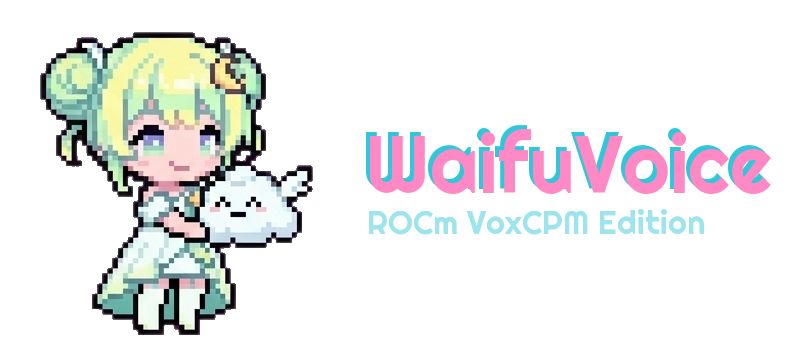
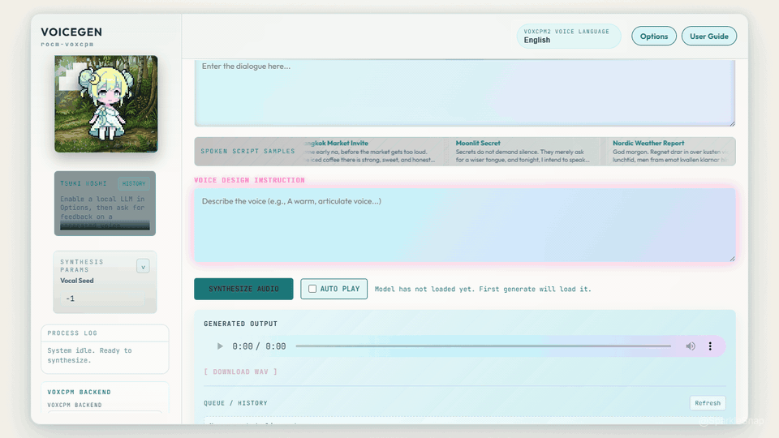

# VoiceGen (rocm-voxcpm)

**ROCm-powered VoxCPM2 voice generation for AMD GPU users.**

VoiceGen is a utility repo: a local app, launcher, and setup path that puts VoxCPM2 into practice on AMD GPUs through ROCm. It is not the upstream VoxCPM2 baseline, model, or training project. It is the practical layer around that code path so more AMD GPU users can actually try the feature, test hardware, and contribute fixes.

The current verified path runs on an **RX 7900 XTX**. The next step is community testing: try it on your AMD card, report what works, and help turn this into a useful starting point for ROCm voice generation.



## Try It, Test It, Improve It

If you have an AMD GPU and want VoxCPM2 off the CPU path, this repo is for you.

- **Try it** if you run Windows + WSL2 and want a ROCm route for VoxCPM2.
- **Test another AMD card** if you have something besides an RX 7900 XTX.
- **Open a report** if setup works, partly works, or fails in a useful way.
- **Send fixes** for ROCm setup notes, launcher portability, docs, or runtime behavior.

The most helpful contribution right now is a hardware test report: GPU model, ROCm version, PyTorch ROCm result, and whether VoxCPM2 generation completed. Use [docs/TEST_REPORT_TEMPLATE.md](docs/TEST_REPORT_TEMPLATE.md).

## What This Is

VoiceGen gives you:

- A utility layer around VoxCPM2: GUI, launcher, and ROCm/WSL notes.
- A browser GUI for writing a spoken script and voice design.
- A Windows PowerShell launcher for the WSL2 + ROCm + VoxCPM2 path.
- Local output/history folders for generated audio.
- Setup notes for ROCm 7.2, ROCDXG, and PyTorch ROCm wheels.
- A contribution path for AMD GPU compatibility results.

This is not a polished commercial product, and it is not a replacement for upstream VoxCPM2. It is an open utility project for ROCm users who want to get VoxCPM2 voice generation running locally and make the path easier for the next person.

## What This Is Not

- Not the upstream VoxCPM2 baseline model or training code.
- Not a claim that every AMD GPU works.
- Not a redistribution point for VoxCPM2 model weights or ROCm system packages.
- Not an AMD or OpenBMB project.

## Verified So Far

The current confirmed path is:

- AMD Radeon RX 7900 XTX / `gfx1100`
- Windows + WSL2
- Ubuntu 22.04
- ROCm 7.2 packages
- ROCDXG from `ROCm/librocdxg`
- PyTorch ROCm wheels
- Local VoxCPM2 model files

Other AMD GPUs may work, but they are not confirmed yet. Please contribute test results instead of assuming support.

## Quick Start

Clone the repo, then create a Python environment inside WSL. This path is only an example:

```bash
python3 -m venv ~/waifuvoice-rocm72
source ~/waifuvoice-rocm72/bin/activate
pip install -r requirements.txt
pip check
```

Install the ROCm/WSL pieces before running the app:

- WSL2 with Ubuntu 22.04.
- AMD Windows driver with WSL ROCm support.
- `/dev/dxg` visible inside WSL.
- ROCm 7.2 packages for Ubuntu 22.04.
- Built and installed `ROCm/librocdxg`.
- PyTorch ROCm wheels installed in the WSL environment.
- `rocminfo` sees your AMD GPU.

The detailed setup guide is [docs/ROCM_WSL_SETUP.md](docs/ROCM_WSL_SETUP.md).

## Model Files

Download VoxCPM2 model files locally and place them under:

```text
models/VoxCPM2/
```

Model weights are not committed to this repo. You can also keep the model elsewhere:

```powershell
$env:VOXCPM_MODEL_PATH = "/mnt/d/path/to/VoxCPM2"
```

## Run

From the repo root in Windows PowerShell:

```powershell
.\start_waifuvoice_vox_wsl_rocm7.ps1
```

Then open:

```text
http://localhost:3113
```

The launcher name still contains `waifuvoice` for v1 compatibility. The same is true for `WAIFUVOICE_*` environment variables, localStorage keys, and output filename prefixes. They are internal compatibility names, not the public project name.

Optional path overrides:

```powershell
$env:WAIFUVOICE_WSL_DISTRO = "Ubuntu-22.04"
$env:WAIFUVOICE_WSL_USER = "root"
$env:WAIFUVOICE_WSL_VENV = "/root/voxcpm-wsl-rocm72"
$env:WAIFUVOICE_DATA_ROOT = "/mnt/d/path/to/VoiceGen"
$env:WAIFUVOICE_APP_ROOT = "/mnt/d/path/to/VoiceGen/app"
```

## What Is Not Committed

This repository ships source code, setup instructions, and lightweight placeholder files only.

- Model weights.
- Python virtual environments.
- Generated WAV files.
- Custom Persona Lab data.
- Local ROCm experiments, installers, logs, and machine-specific notes.

## Contributing

Contributions are welcome when they make AMD GPU voice generation easier to reproduce.

Good first contributions:

- A test report for another AMD GPU.
- A clearer ROCm/WSL validation step.
- A launcher fix for a different local path or WSL user.
- A PyTorch ROCm compatibility note.
- A docs correction that saves someone else an hour.

Start with [CONTRIBUTING.md](CONTRIBUTING.md), or open a report using [docs/TEST_REPORT_TEMPLATE.md](docs/TEST_REPORT_TEMPLATE.md).

## License, Assets, And Trademarks

The utility code and documentation text in this repository are released under the Apache License 2.0. This aligns the app layer with the Apache-2.0 licensing used by upstream VoxCPM2/OpenBMB while keeping this project independent.

Mascots, logos, brand images, SparkleSnap marks, screenshots, and README/demo media are not licensed as Apache-2.0 code. They are covered separately by [docs/ASSET_LICENSE.md](docs/ASSET_LICENSE.md), so contributors can use the app while the visual identity stays distinct from the code license.

Third-party models, libraries, and assets remain under their own licenses; see [docs/THIRD_PARTY_NOTICES.md](docs/THIRD_PARTY_NOTICES.md) and [NOTICE](NOTICE).

This project is independent and is not affiliated with, sponsored by, or endorsed by AMD or OpenBMB. AMD ROCm(tm) and related marks are trademarks of Advanced Micro Devices, Inc.
